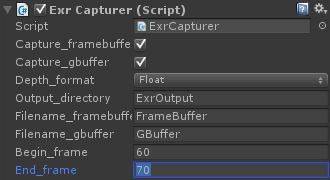

# FrameCapturer

FrameCapturer is a plug-in for Unity that allow you to capture frame buffer and export to image or movie files. Currently supported are gif and exr.

## Gif Capturer
features:
- Keeps last N frames on memory and write a part of it to file later (similar to ShadowPlay or PS4)
- Async & parallel encoding
- In-game previewer and simple editor
- Supports D3D9, D3D11 and OpenGL graphics APIs, x86 and x86-64 architectures. (Confirmed only on Windows)

demo video:  
  

examples: this image is exported by this plug-in. (This scene is included in this repository)  
  

### Usage
1. Import [this package](https://github.com/unity3d-jp/FrameCapturer/blob/master/Packages/GifRecoder.unitypackage?raw=true) to your project
2. Add GifCapturer component to camera that you want to record
3. Place GifCapturerHUD.prefab (uGUI object) to somewahere, and set GifCapturer (that is added in 2.) to its capturer parameter

3 is not required, but GifCapturer needs GUI or scripts to turn on/off recording, write to file, etc. Modifing GifCapturerHUD.prefab is good way to make your own GUI.  

## Exr Capturer  
Exr is a HDR image file format, and ExrCapturer can export G-Buffer, frame buffer, and any RenderTextures to exr files. This is useful for movie makers (visual effects & composition).
Exporting exr is hard to do in real-time. So ExrCapturer assumes delta-time is fixed and exports frames in predefined range.

  

### Usage
1. Import [this package](https://github.com/unity3d-jp/FrameCapturer/blob/master/Packages/FrameCapturer_Exr.unitypackage?raw=true) to your project
2. Add ExrCapturer component to camera that you want to record
3. Set begin / end frame and play  
  